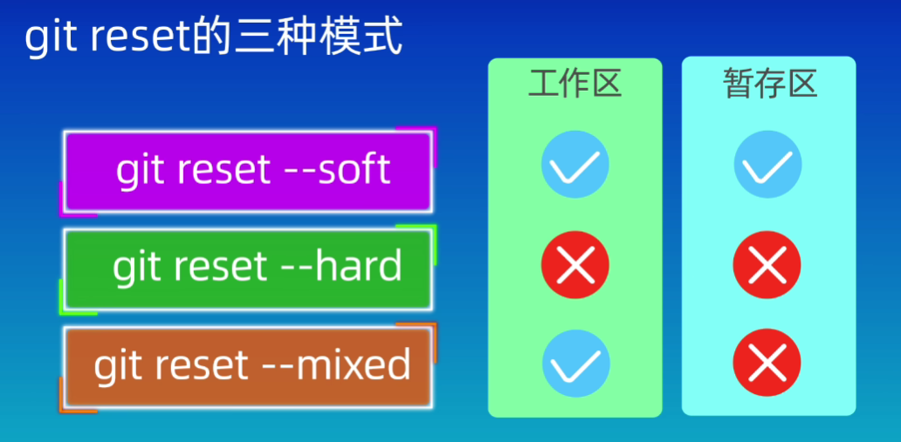

### git配置


```shell
git config --global user.name <yourname>
git config --global user.email <youremail>
git config --global credential.helper store #保存配置
git config --global --list 					#查看配置
```

` --global `：全局配置，所有仓库生效

` --system `：系统配置，所有用户生效

省略：本地配置，本地仓库生效


### 新建版本库

- #### git init

``` shell
git init <path>			#将在当前目录/path下创建.git
```

- #### git clone

```shell 
git clone <url>
```


### 工作区域和文件状态

​	


### 将文件添加到仓库


- #### 查看仓库状态

  ``` shell
  git status
  git status -s	#简略信息
  ```

- #### 添加到暂存区

  ```shell 
  git add <filepath> 
  ```

  filepath支持正则表达

  ```shell
  git add .
  git add *.txt
  ```

- #### 提交

  ```shell 
  git commit
  # git commit -m "commitmsg"
  ```

  不使用 -m 参数时，将进入vim模式编辑提交信息

  #### vim

  -  ` i `：进入编辑模式
  - ` wq `：保存退出

  #### 查看提交记录

  ```shell
  git log
  ```

  简洁记录

  ```shell
  git log --online
  ```


### 回退版本

``` shell
git reset
```

- #### 3种模式

  

  如果误操作` --hard `回退：

  #### 回溯

  ```shell
  git reflog					#查看历史操作
  git reset --hard <ID>		#使用hard操作前版本号回溯
  ```


### 查看版本差异

```shell
git diff				#比较工作区和暂存区
git diff HEAD			#比较工作区与版本库
git diff --cached		#比较暂存区和版本库
git diff <ID1> <ID2>	#比较两个版本
git diff HEAD~ HEAD		#前一个版本和当前版本
git diff HEAD~2 HEAD	#前第二个版本和当前版本
git diff <filename>		#只查看某文件的差异
```


### 删除文件

​	在工作区删除后更新暂存区

```shell
rm <filename>
git add .
```

​	或

#### 	git rm

```shell
git rm <filename>			#同时删除工作区和暂存区
git rm --cached <filename>	#保留工作区文件
git rm -r *					#删除所有子目录和文件
```

​	注意修改完后提交

### .gitignore文件

​	一般应忽略以下文件：

- 系统或软件自动生成的文件
- 编译产生的中间文件和结果文件
- 运行时生成的日志、缓存、临时文件
- 涉及身份、密码、口令、密钥等敏感文件

### 其他命令

- #### 列出工作区（所有）文件

  ```shell
  ls (-a)
  ```

- #### 列出暂存区文件

  ```shell
  git ls-files
  ```

- #### 创建文件

  ```shell
  echo "text" > <filepath>
  echo "add_text" >> <filepath>	#追加内容
  ```

- #### 查看文件

  ```shell
  cat <filepath>
  ```

- #### 修改文件名

  ```shell 
  mv <oldname> <newname>
  ```

- #### 创建文件夹

  ```shell
  mkdir <foldername>
  ```

  空文件夹不会被纳入版本控制


### GitHub远程仓库

- #### SSH配置

  ```shell
  cd							#回到根目录
  cd .ssh
  ssh-keygen -t rsa -b 4096	#生成SSH密钥
  # -t指示协议，-b指示大小
  ```

  根据提示输入文件名和密码后将生成两个文件 ` <name> ` 和 ` <name>.pub ` ，前者是私钥文件，后者是公钥文件，将公钥添加到GitHub上

- #### 远程仓库

  - 将已有远程仓库克隆到本地

  - 将已有本地仓库添加到远程

    ```shell
    git remote add origin <url>
    # git remote add <shortname> <url>
    
    git remote -v	#查看远程仓库
    
    git push -u origin main
    # git push -u <shortname> <branch>
    ```

- #### 推送

  ```shell
  git push <remote> <branch>
  ```

- #### 拉取

  ```shell
  git pull <remote> <branch_re>:<branch_lo>
  ```


### 分支
