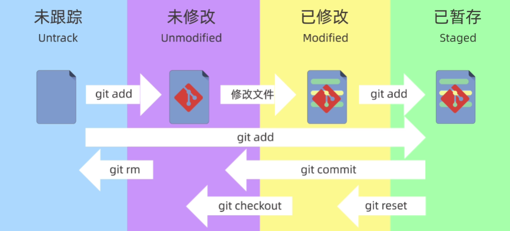

### git配置


```shell
git config --global user.name <yourname>
git config --global user.email <youremail>
git config --global credential.helper store #保存配置
git config --global --list                  #查看配置
```

` --global `：全局配置，所有仓库生效

` --system `：系统配置，所有用户生效

省略：本地配置，本地仓库生效

****

### 新建版本库

- #### git init

  ``` shell
  git init <path>			#将在当前目录/path下创建.git
  ```

- #### git clone

  ```shell 
  git clone <url>
  ```

****

### 工作区域和文件状态

​	





****

### 将文件添加到仓库


- #### 查看仓库状态

  ``` shell
  git status
  git status -s	  #简略信息
  ```

- #### 添加到暂存区

  ```shell 
  git add <filepath> 
  ```

  filepath支持正则表达

  ```shell
  git add .
  git add *.txt
  ```

- #### 提交

  ```shell 
  git commit
  # git commit -m "commitmsg"
  ```

  不使用 ` -m ` 参数时，将进入vim模式编辑提交信息

  - #### vim

    -  ` i `：进入编辑模式
    - ` wq `：保存退出

  使用 ` -a ` 可以同时进行暂存和提交
  ```shell
  git commit -a -m "commitmsg"
  ```

  #### 查看提交记录

  ```shell
  git log
  ```

  简洁记录

  ```shell
  git log --online
  ```

****

### 回退版本

``` shell
git reset
```

- #### 3种模式

  

  如果误操作` --hard `回退：

  #### 回溯

  ```shell
  git reflog              #查看历史操作
  git reset --hard <ID>   #使用hard操作前版本号回溯
  ```

****

### 查看版本差异

```shell
git diff              #比较工作区和暂存区
git diff HEAD         #比较工作区与版本库
git diff --cached     #比较暂存区和版本库
git diff <ID1> <ID2>  #比较两个版本
git diff HEAD~ HEAD   #前一个版本和当前版本
git diff HEAD~2 HEAD  #前第二个版本和当前版本
git diff <filename>   #只查看某文件的差异
```

****

### 删除文件

​	在工作区删除后更新暂存区

```shell
rm <filename>
git add .
```

​	或

#### 	git rm

```shell
git rm <filename>           #同时删除工作区和暂存区
git rm --cached <filename>  #保留工作区文件
git rm -r *                 #删除所有子目录和文件
```

​	注意修改完后提交

****

### .gitignore文件

​	一般应忽略以下文件：

- 系统或软件自动生成的文件
- 编译产生的中间文件和结果文件
- 运行时生成的日志、缓存、临时文件
- 涉及身份、密码、口令、密钥等敏感文件

****

### 其他命令

- #### 列出工作区（所有）文件

  ```shell
  ls (-a)
  ```

- #### 列出暂存区文件

  ```shell
  git ls-files
  ```

- #### 创建文件

  ```shell
  echo "text" > <filepath>
  echo "add_text" >> <filepath> #追加内容
  ```

- #### 查看文件

  ```shell
  cat <filepath>
  ```

- #### 修改文件名

  ```shell 
  mv <oldname> <newname>
  ```

- #### 创建文件夹

  ```shell
  mkdir <foldername>
  ```

  空文件夹不会被纳入版本控制


****

### GitHub远程仓库

- #### SSH配置

  ```shell
  cd                        #回到根目录
  cd .ssh
  ssh-keygen -t rsa -b 4096 #生成SSH密钥
  # -t指示协议，-b指示大小
  ```

  根据提示输入文件名和密码后将生成两个文件 ` <name> ` 和 ` <name>.pub ` ，前者是私钥文件，后者是公钥文件，将公钥添加到GitHub上

- #### 远程仓库

  - 将已有远程仓库克隆到本地

  - 将已有本地仓库添加到远程

    ```shell
    git remote add origin <url>
    # git remote add <shortname> <url>
    
    git remote -v #查看远程仓库
    
    git push -u origin main
    # git push -u <shortname> <branch>
    ```

- #### 推送

  ```shell
  git push <remote> <branch>
  ```

- #### 拉取

  ```shell
  git pull <remote> <branch_re>:<branch_lo>
  ```


****

### 分支

- #### 查看分支

  ```shell
  git branch
  ```

- #### 创建分支

  ```shell
  git branch <branch>
  ```

- #### 切换分支

  ```shell
  git checkout <branch>   #切换分支/恢复
  git switch <branch>     #切换分支专用
  ```

- #### 合并分支

  ```shell
  git swicth <target>     #切换到目标/主分支
  git merge <source>      #把source合并到target
  ```

  分支合并后不会消失

- #### 查看分支图

  ```shell
  git log --graph --online --decorate --all
  ```

  考虑到该命令的长度，建议使用 ` alias ` 命令定义别名

  ```shell
  alias graph="git log --graph --online --decorate --all"
  ```

  之后可以使用 ` graph ` 替代上述指令

- #### 删除分支

  ```shell
  git branch -d <branch>
  ```

  ` -d ` 表示删除已合并的分支，若要删除未合并分支，应使用 ` -D ` 命令  

  ```shell
  git branch -D <branch>      #强制删除分支
  ```


****

### 冲突  

若不同分支修改了同一个文件的同一行代码，将产生冲突

- #### 查看冲突

  ```shell
  git status    #查看冲突文件
  git diff      #查看冲突具体内容
  ```

- #### 处理冲突

  手动编辑文件

- #### 中止合并

  ```shell
  git merge --abort
  ```


****


### 变基（Rebase）

  直接将本分支移动到目标分支末尾

  ```shell
  git switch <source>
  git rebase <target>
  ```

  则分支变化如下

  ```
                                                * source:2
                                                |
                                                * source:1
                                                |
             | * source:2                       |                
   target:3  * |                      target:3  *             
             | * source:1    ---\               |                           
   target:2  * /             ---/     target:2  *                           
   target:1  *                        target:1  *                  
             |                                  |           
             |                                  |               
   
  ```

- #### 与 merge 的区别

  - **merge** 

    >优点：不会破坏原分支提交记录，方便回溯和查看  
    缺点：会产生额外提交节点，分支图比较复杂

  - **rebase**

    >优点：不会新增额外的提交记录，形成线性历史，直观干净  
    缺点：会改变提交历史，改变当前分支branch out 节点，不建议在共享分支使用 

  **不关心提交历史，仅用来合并分支，可以使用merge；**

  **个人分支，且希望提交记录清晰明了，考虑使用rebase.**


****


### 工作流模型

- #### GitFlow 模型

  - **主线分支（main）**

    项目的**核心分支**，包含项目的稳定版本代码，应随时保证其中的代码可发布 

    代码不允许直接修改，只能通过合并分支来修改  

    每次合并分支都建议生成新的版本号

    **版本号**

    ```shell
    git tag
    ```

    >**编号规则：**     
    **主版本**（Major Version）：主要的功能变化或重大更新；   
    **次版本**（Minor Version）：一些新的功能、改进和更新，通常不会影响现有功能；   
    **修订版本**（Patch Version）：一些小的bug修复，安全漏洞补丁等，通常不会更改现有功能和接口。


  - **问题修复分支（hotfix）**

    包含项目问题修复的源码   

    一般从主线分支中分离出来，修复后合并到主线或开发分支   

    合并后一般会删除

  - **开发分支（develop）**

    项目的**核心分支**，包含项目的最新版本开发源码

    一般从主线分支中分离出来


  - **功能分支（feature）**

    包含项目某个新功能开发的代码   

    从开发分支中分离出来，开发完成后合并回开发分支

    不同的功能应归属不同的功能分支


  - **预发布分支（release）**

    包含了项目最新预发布版本的代码，用于发布前的测试和验证

    一般从开发分支中分离出来，测试稳定后合并至主线或开发分支


- #### GitHub Flow 模型

  
    


****


### 规范

- #### 分支的命名

  使用带有意义的描述性名称来命名分支

  >版本发布分支/Tag示例：v1.0.0   
  功能分支示例：feature-login-page   
  修复分支示例：hotfix-#issueid-desc

- #### 分支的管理

  定期合并已经成功验证的分支，及时删除已经合并的分支

  保持合适的分支数量

  为分支设置合适的管理权限
